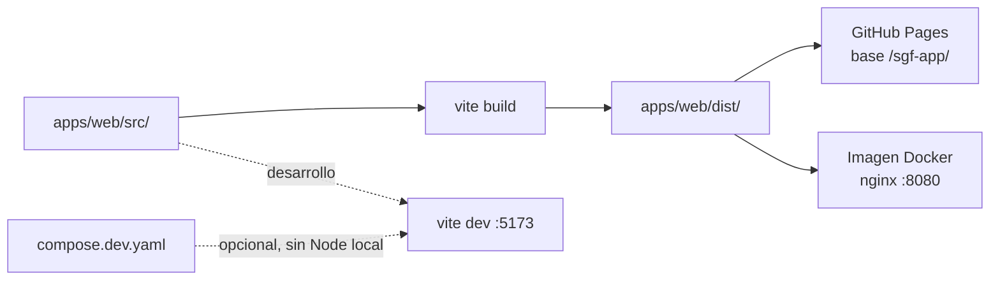

# Arquitectura

Cómo está montado el repositorio, por qué, y qué hay que tocar cuando toque
cambiarlo. Para el *porqué* detallado de cada decisión, y sobre todo para lo
que se descartó, ver [`decisions/`](decisions/).

Este documento describe el estado actual. Cuando el estado cambie, se
reescribe; los ADR, en cambio, no se reescriben nunca.

## Qué es este repositorio

Un monorepo que hoy contiene una aplicación —el frontend web— y está preparado
para alojar al menos dos más: un backend, previsiblemente en Java, y un
empaquetado de escritorio de la propia web.

La particularidad, y lo que hay que entender antes que nada, es que **no hay
ninguna herramienta que orqueste el monorepo**. No es un descuido ni una fase
provisional: es la decisión de [ADR-0004](decisions/0004-sin-orquestador-de-monorepo.md).

## Mapa del repositorio

| Directorio          | Qué contiene                              | Se construye con        |
| ------------------- | ----------------------------------------- | ----------------------- |
| `apps/web/`         | SPA de React 19 + Vite                    | npm, dentro del propio directorio |
| `apps/web-legacy/`  | Sitio estático original, previo a React   | Nada: no se construye   |
| `packages/`         | Código compartido entre apps              | Vacío por ahora         |
| `docs/`             | Esta documentación                        | —                       |
| `compose.dev.yaml`  | Entorno de desarrollo del conjunto        | Docker Compose          |
| `.github/workflows/`| CI. Hoy solo el despliegue de la web      | GitHub Actions          |

En la raíz **no hay ningún manifiesto de dependencias**. No hay `package.json`,
ni lockfile, ni configuración de linter. Si aparece uno, algo se ha hecho mal:
ver la regla de abajo.

## La regla que lo sostiene: cada app es autónoma

Todo lo demás se deriva de esto.

1. **Una app se construye y se ejecuta desde su propio directorio, con las
   herramientas de su lenguaje.** `cd apps/web && npm install && npm run dev`
   funciona sin que exista nada por encima.
2. **Nada se comparte implícitamente.** Las dependencias se declaran dentro de
   cada app. Ninguna app importa ficheros de otra por ruta relativa.
3. **Lo único común es `compose.dev.yaml`**, y solo para levantarlas juntas en
   una misma red. No compila nada.

El motivo práctico: el backend será Java. Quien trabaje en él no debería
necesitar Node instalado, ni quien trabaje en la web necesitar un JDK. Una capa
de npm por encima del monorepo rompería eso el primer día.

## Cómo se construye y se despliega la web

**Desarrollo.** `npm run dev` dentro de `apps/web`, o `docker compose -f
compose.dev.yaml up web` desde la raíz si no se quiere instalar Node. Las dos
vías sirven en `http://localhost:5173/sgf-app/`.

**Imagen de producción.** `docker build -t sgf-web apps/web`. Es un build
multietapa: compila con Node y sirve el resultado con nginx en el puerto 8080,
como usuario sin privilegios, sin Node en la imagen final. El contexto de build
es `apps/web`, no la raíz — la app no necesita nada de fuera.

**Despliegue.** `.github/workflows/deploy.yml` compila y publica en GitHub Pages
en cada push a `main`. En los pull requests solo compila y pasa el linter.

### El detalle que sorprende: la base `/sgf-app/`

El sitio se publica en `https://daerk-z.github.io/sgf-app/`, un subdirectorio
del dominio, porque el nombre `<usuario>.github.io` ya está ocupado por otro
sitio. Por eso `vite.config.js` fija `base: '/sgf-app/'`, y por eso el dev
server también sirve bajo esa ruta: para que la aplicación se comporte igual en
los dos entornos.

Dos consecuencias que conviene tener presentes:

- **La base se congela en el bundle al compilar.** No es configurable al
  arrancar el contenedor. De ahí que la imagen la reciba como `--build-arg
  BASE_PATH=...` y no como variable de entorno.
- **Ni Pages ni nginx reescriben rutas.** Una URL como `/sgf-app/panel/ventas`
  no tiene fichero detrás. Pages lo resuelve publicando `index.html` también
  como `404.html`; nginx, con un `try_files` que cae en `index.html`. Son dos
  mecanismos distintos para el mismo problema, y hay que tocar los dos si
  cambia el enrutado.

## Dónde encajan las apps que faltan

Ninguna existe todavía y no hay nada que inicializar hasta que se empiecen. Lo
que sí está decidido es dónde van y qué traen.

**`apps/api/`** — Backend. Su propio `pom.xml` o `build.gradle.kts`, su propio
`Dockerfile`, su propio workflow de CI. No comparte nada con la web salvo la
red de `compose.dev.yaml`; hay una plantilla comentada ahí, escrita para
Java/Gradle. La elección entre Gradle y Maven sigue abierta y no afecta a nada
de este documento.

**`apps/desktop/`** — Envuelve el bundle que produce `apps/web`, así que
dependerá de él. En desarrollo se ejecuta en el host, no en un contenedor:
necesita servidor gráfico y acceso al hardware.

**Qué *no* cambia cuando lleguen:** la raíz sigue sin manifiesto, `apps/web`
sigue construyéndose igual, y el workflow de Pages sigue siendo exclusivamente
suyo.

## Cómo evoluciona esto

La arquitectura actual está dimensionada para dos o tres apps. Estos son los
disparadores concretos que justificarían cambiarla, y qué hacer en cada caso.

| Cuándo                                                        | Qué hacer                                                                 | Detalle |
| ------------------------------------------------------------- | ------------------------------------------------------------------------- | ------- |
| Llega `apps/api`                                              | Workflow de CI propio, servicio en `compose.dev.yaml`                    | [ADR-0003](decisions/0003-empaquetado-y-ci-por-aplicacion.md) |
| Hay más de un workflow y los PR construyen lo que no tocan    | Añadir `paths:` a cada workflow (`apps/web/**`, `apps/api/**`)           | [ADR-0003](decisions/0003-empaquetado-y-ci-por-aplicacion.md) |
| Hace falta un «construye todo» en un solo comando             | Lanzador de tareas fino en la raíz (`Taskfile.yml`), que delegue          | [ADR-0004](decisions/0004-sin-orquestador-de-monorepo.md) |
| `packages/` pasa a tener código JS con **dos** consumidores   | Reintroducir npm workspaces: `package.json` en la raíz con `workspaces`  | [ADR-0002](decisions/0002-npm-workspaces-para-javascript.md) |
| El contrato de la API se estabiliza                           | Especificación OpenAPI en `packages/`, generando tipos TS y DTO Java     | [ADR-0004](decisions/0004-sin-orquestador-de-monorepo.md) |
| Docenas de apps, grafo de dependencias profundo, CI intratable | Reabrir la evaluación de Nx o Bazel — no antes                           | [ADR-0004](decisions/0004-sin-orquestador-de-monorepo.md) |

El orden importa: casi todas esas filas son cambios pequeños y locales. La
última no lo es, y por eso su disparador es deliberadamente exigente.

## Qué se ha descartado

Resumen. El razonamiento completo, con las condiciones que reabrirían cada
caso, está en los ADR.

| Descartado                          | En una línea                                                             |
| ----------------------------------- | ------------------------------------------------------------------------ |
| **npm workspaces**                  | Con una sola app JS y `packages/` vacío no enlazaba nada                 |
| **Bazel / Pants**                   | Beneficios activados por escala; coste desde el día uno. Y su lado flojo es JS |
| **Nx**                              | Motor de grafo y caché para coordinar dos comandos                       |
| **Turborepo**                       | Céntrico en paquetes npm: el backend Java acabaría disfrazado de app JS  |
| **Moon**                            | La opción polyglot razonable, pero sigue siendo un framework que aprender |
| **npm como orquestador raíz**       | Haría de Node una dependencia para compilar Java                         |
| **`legacy/` en la raíz**            | Movido a `apps/web-legacy/` por simetría con el resto de apps            |

## Decisiones registradas

- [ADR-0001 — Estructura del monorepo](decisions/0001-estructura-del-monorepo.md)
- [ADR-0002 — npm workspaces para JavaScript](decisions/0002-npm-workspaces-para-javascript.md) *(sustituida)*
- [ADR-0003 — Empaquetado y CI por aplicación](decisions/0003-empaquetado-y-ci-por-aplicacion.md)
- [ADR-0004 — Sin orquestador de monorepo](decisions/0004-sin-orquestador-de-monorepo.md)
